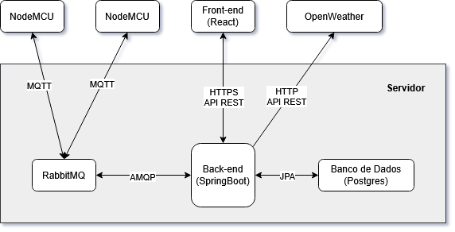
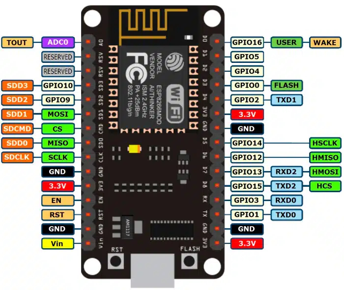
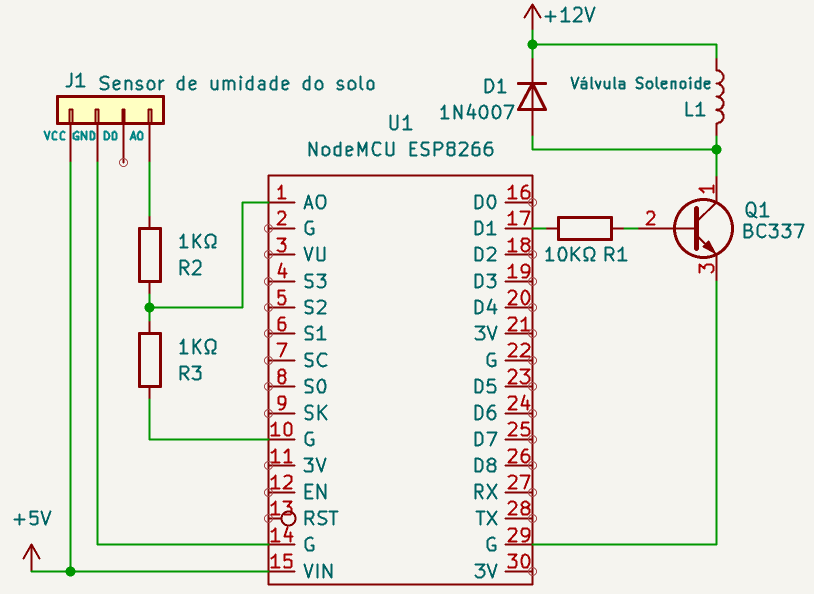
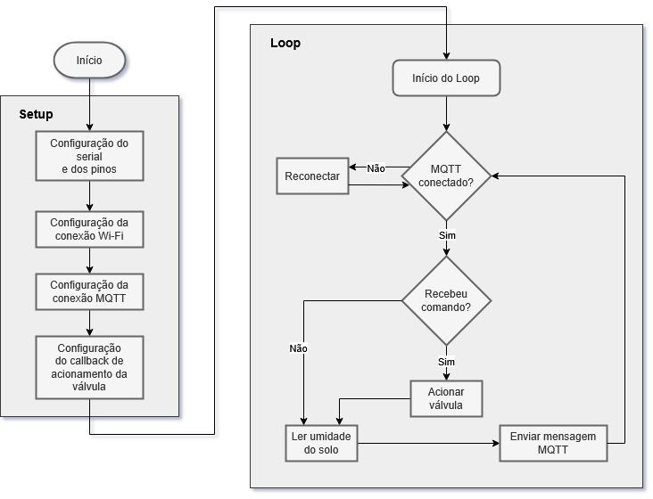
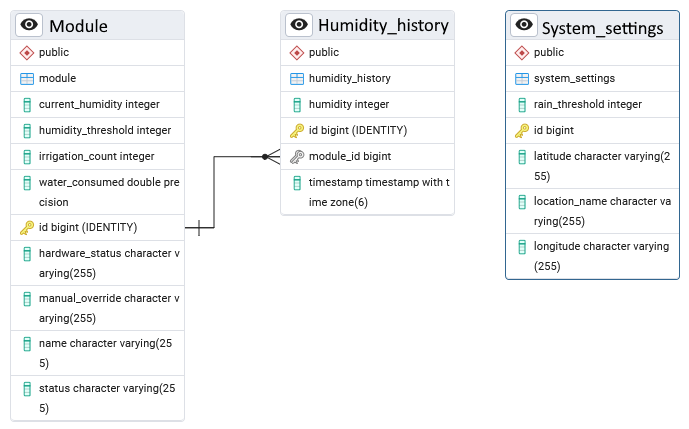
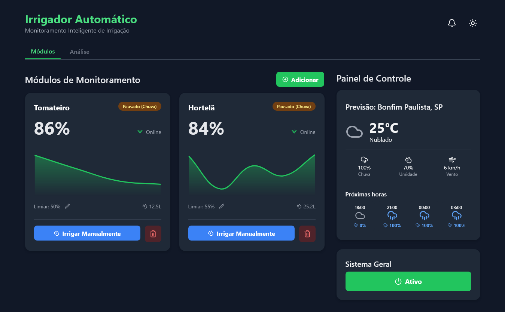
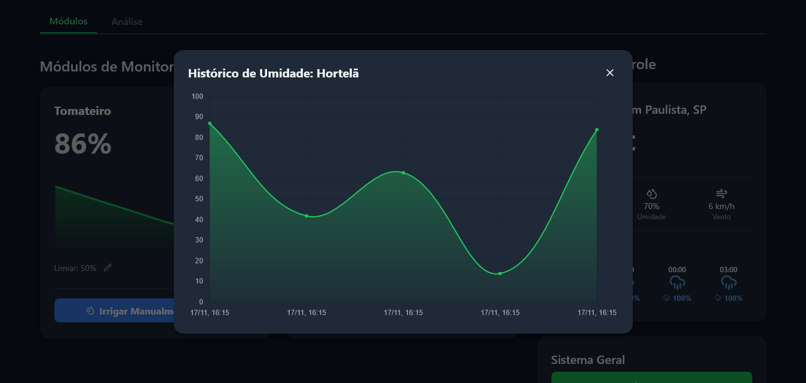
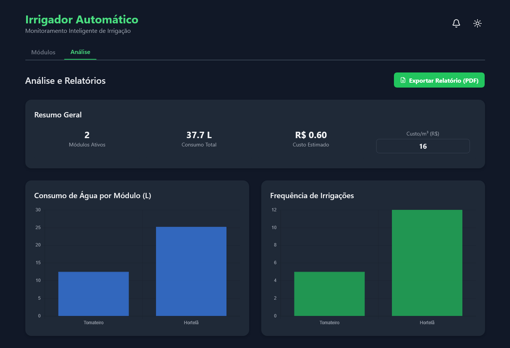

# Sistema para Monitoramento e Controle de Irrigação IoT Modular

Este projeto é um sistema full-stack de irrigação inteligente desenvolvido como Trabalho de Conclusão de Curso (TCC) em Ciência da Computação na Universidade Federal de Lavras (UFLA). O objetivo é otimizar o uso de recursos hídricos na agricultura através de uma arquitetura modular, escalável e de baixo custo.

**Autor:** Eduardo Dezena Gonçalves

**Instituição:** Universidade Federal de Lavras (UFLA)

**Ano:** 2025

## 📑 Índice

1. [🚀 Visão Geral](#🚀-visão-geral)
2. [📁 Estrutura do Projeto](#📁-estrutura-do-projeto)
3. [🏗️ Arquitetura do Sistema](#🏗️-arquitetura-do-sistema)
4. [🔧 Hardware e Circuito](#🔧-hardware-e-circuito)
5. [💻 Detalhamento do Sistema](#💻-detalhamento-do-sistema)
6. [🛠️ Como Executar o Projeto](#🛠️-como-executar-o-projeto)
7. [🤝 Contribuição](#🤝-contribuição)
8. [📄 Licença](#📄-licença)

## 🚀 Visão Geral

O sistema permite o monitoramento em tempo real da umidade do solo e o controle automatizado de uma válvula de solenoide para irrigação. A decisão de irrigar é tomada de forma inteligente, cruzando dados locais (sensor) com dados externos (previsão de chuva via API OpenWeather).

### Principais Funcionalidades

- **Monitoramento em Tempo Real:** Visualização da umidade do solo via Dashboard web.

- **Automação Inteligente:** Lógica baseada em limiares de umidade e probabilidade de chuva.

- **Controle Remoto:** Acionamento manual de válvulas através da interface React.

- **Histórico e Análise:** Gráficos detalhados de consumo de água e variações de umidade.

## 📁 Estrutura do Projeto

O repositório está organizado nos seguintes diretórios principais:

- `irrigador-firmware/`: Firmware desenvolvido em C++ para controle do hardware (NodeMCU ESP8266).
- `irrigador-api/`: Serviço Back-end desenvolvido em Java com Spring Boot, responsável pela lógica de negócio e persistência.
- `irrigador-front/`: Interface Web desenvolvida em React com Tailwind CSS para monitoramento e controle.

## 🏗️ Arquitetura do Sistema

O projeto utiliza uma estrutura desacoplada para garantir modularidade e resiliência.



### Stack Tecnológica

- **Hardware:** NodeMCU ESP8266 (ESP-12E)

- **Firmware:** C++ (Arduino)

- **Back-end:** Spring Boot

- **Front-end:** React com Tailwind CSS

- **Broker:** Protocolo MQTT e RabbitMQ

- **Banco de Dados:** PostgreSQL

- **Container:** Docker e Docker Compose

## 🔧 Hardware e Circuito

O hardware foi projetado para ser acessível, utilizando componentes de baixo custo e fácil substituição.

| Item           | Descrição                                                             |
|----------------|-----------------------------------------------------------------------|
| Placa de Desenvolvimento | NodeMCU ESP8266 ESP-12E                                              |
| Sensor         | sensor de umidade do solo resistivo                       |
| Atuador         | Válvula Solenoide 12V DC                                              |
| Interface      | Transistor BC337 (NPN) e Diodo 1N4007 (Flyback)                      |
| Alimentação    | Fontes chaveadas de 5V (Lógica) e 12V (Válvula)                       |

### Esquemático e Montagem

Esquemático do pinout do NodeMCU.



Esquemático do circuito eletrônico.



Foto do protótipo final montado.


## 💻 Detalhamento do Sistema

### Firmware (NodeMCU)

O firmware é responsável pela telemetria e execução de comandos de atuação.



### Back-end e Banco de Dados

  O servidor processa eventos e armazena o histórico de monitoramento. A decisão de irrigação é centralizada no serviço Spring Boot, que processa os eventos recebidos:

  1. O NodeMCU publica a umidade via MQTT a cada 60 segundos.

  1. O servidor consulta a API OpenWeather.

  1. Se `umidade < limiar` e `chance_chuva < limite_seguro`, o comando de irrigação é enviado.

  

### Interface Web (React)

  A interface fornece uma visão gerencial completa dos módulos instalados, permitindo a configuração individual de cada sensor e análise de dados.

  Painel principal com monitoramento em tempo real.
  

  Visualização detalhada da variação de umidade.
  

  Relatórios de consumo de água e frequência de acionamentos.
  


## 🛠️ Como Executar o Projeto

### Pré-requisitos

- Docker e Docker Compose instalados.

- Arduino IDE (para upload do firmware).

### Instalação

1. **Clonar o repositório:**

    ```
    git clone https://github.com/Dezena14/Irrigador.git
    cd Irrigador
    ``` 


1. **Configurar o Back-end:** Configure suas credenciais do PostgreSQL e API Key da OpenWeather no arquivo `application.properties` e `.env`.

1. **Subir os serviços (Banco de Dados e Broker):**

    ```
    docker-compose up -d
    ```

1. Executar o Front-end:

    ```
    cd irrigador-front
    npm install
    npm start
    ```

## 🤝 Contribuição

Contribuições são muito bem-vindas! Para contribuir:

1. Faça um **Fork** do projeto.

1. Crie uma **Branch** `(git checkout -b feature/NovaFeature)`.

1. Dê um Commit em suas alterações `(git commit -m 'Adicionando nova feature')`.

1. Faça o **Push** `(git push origin feature/NovaFeature)`.

1. Abra um **Pull Request**.

## 📄 Licença

Este projeto está licenciado sob a licença MIT.